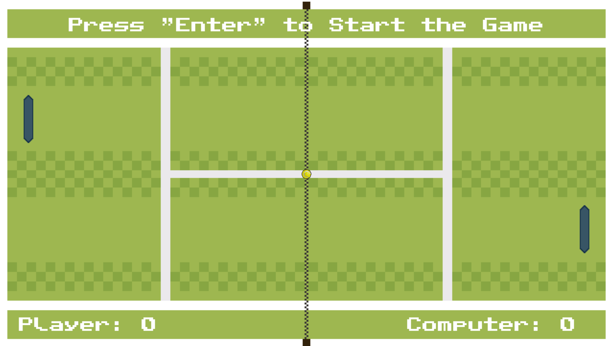

# 🏓 Pong

Pong was originally created by [Atari](https://atari.com/collections/pong-collection) in 1972. The game features two paddles, one controlled by the player and the other by the computer. The goal is to get the ball past the opponent's paddle to score. The first to score 10 points wins.

## 🛠️ Tech Stack
<div>
    &nbsp;
    &nbsp;
<div>

## ▶️ How To Play

1. Download the [LOVE2D](https://love2d.org/) framework and set the environment variable.
2. Clone the repository and change to the root directory of the project.

```sh
git clone https://github.com/leo9iota/pong.git && cd pong
```

3. Run the following command and have fun!

```sh
love .
```

## 📈 Progression


